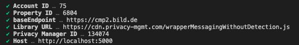

# Red Sourcepoint CMP

[](https://www.npmjs.com/package/@spring-media/red-sourcepoint-cmp)
[](https://github.com/spring-media/red-sourcepoint-cmp/blob/master/LICENSE)
[](https://spring-media.github.io/red-sourcepoint-cmp)

* [Introduction](#introduction)
* [Installation](#installation)
* [Modules](#modules)
  * [Vendor Mapping](#static-vendor-mapping-module)
  * [TCF V2](#tcf-v2-api-module)
  * [Sourcepoint](#sourcepoint-module)
  * [Embed Utils](#embed-utils-module)
  * [Vue](#vue-module)
* [Playground](#playground)

# Introduction

This repository covers the implementation of CMP (Content Management Platform) for www.bild.de by using the Sourcepoint API.

## Installation

```sh
npm i @spring-media/red-sourcepoint-cmp
```

## Modules

The project is organised into several (mostly) independent modules, that are described below:

## Static Vendor Mapping Module

An API for (hardcoded) mappings of (custom) vendors and purposes and their relations between each other.

[Documentation](src/vendor-mapping#static-vendor-mapping-module)

## TCF-V2 API Module

An (tiny) abstraction layer for the IAB TCF-V2 specs

[Documentation](src/tcf-v2#tcf-v2-api-module)

## Sourcepoint Module

An (tiny) abstraction layer for the Sourcepoint API

[Documentation](src/sourcepoint#sourcepoint-module)

## Embed Utils Module

A collection of utils for handling (social) embeds.

[Documentation](src/embed-utils#embed-utils-module)

## Vue Module

A collection of Vue components for the integration of the API's above.

[Documentation](src/vue#vue-integration-module)

## Playground

The purpose of the playground is to test the feature set of our library (manually and automated) within a browser.
It uses the compiled modules from the dist folder to provide two small applications, one for the esm bundle and one for the browser bundle.

Start the playground by running the following command:
```shell
npm run playground:start
```

Some questions are asking the first time, with some predefined sensible default settings.

<p>
  
</p>

> Use a modern browser for testing because the code is not transformed to be compatible with older browsers that do not fully support ES6.
