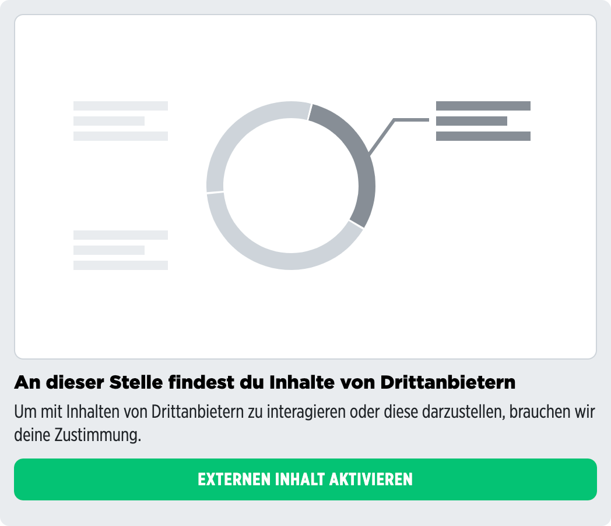

# Placeholder component for generic embeds

> This component is also being used as the base component for vendor specific placeholder components.

<p>
  
</p>

<details>
<summary>Example</summary>

```javascript
<template>
  <embed-placeholder :privacyManagerId="privacyManagerId"></embed-placeholder>
</template>

<script>
import { EmbedPlaceholder } from '@spring-media/red-sourcepoint-cmp/dist/esm/vue/components/embed-placeholder';

export default {
  components: { EmbedPlaceholder },
  data: () => ({
    privacyManagerId: 12345,
  }),
};
</script>

<style lang="scss">
@import '~@spring-media/red-sourcepoint-cmp/dist/esm/vue/components/embed-placeholder.css';
</style>
```
</details>

## Props

| Name             | Type   | Required | Description |
| ---------------- | ------ | -------- | ----------- |
| privacyManagerId | number | true     | Id of a privacy manager to open when clicking on certain areas within the placeholder |
