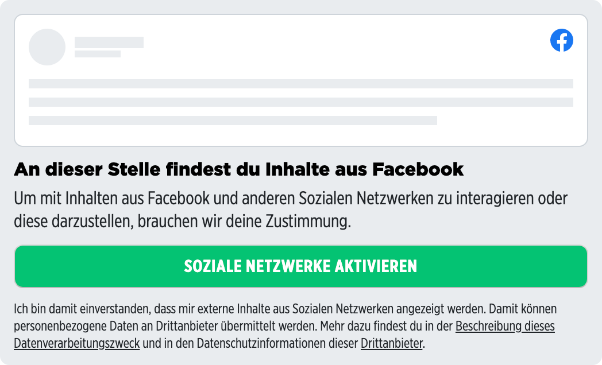
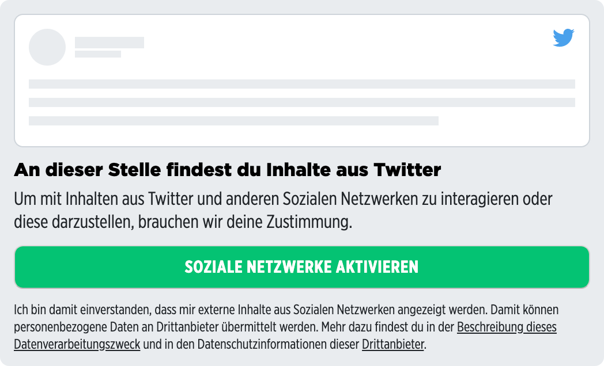

# Embed Placeholder Components

## Components

### Facebook

Placeholder for Facebook embeds.

<p>
  
</p>

<details>
<summary>Usage</summary>

```javascript
<template>
  <embed-placeholder-facebook></embed-placeholder-facebook>
</template>

<script>
import { EmbedPlaceholderFacebook } from '@spring-media/red-sourcepoint-cmp/dist/esm/vue/EmbedPlaceholder';

export default {
  components: { EmbedPlaceholderFacebook },
};
</script>

<style lang="scss">
@import '~@spring-media/red-sourcepoint-cmp/dist/esm/vue/EmbedPlaceholder.css';
</style>
```
</details>

### Instagram

Placeholder for Instagram embeds.

<p>
  
</p>

<details>
<summary>Usage</summary>

```javascript
<template>
  <embed-placeholder-instagram></embed-placeholder-instagram>
</template>

<script>
import { EmbedPlaceholderInstagram } from '@spring-media/red-sourcepoint-cmp/dist/esm/vue/EmbedPlaceholder';

export default {
  components: { EmbedPlaceholderInstagram },
};
</script>

<style lang="scss">
@import '~@spring-media/red-sourcepoint-cmp/dist/esm/vue/EmbedPlaceholder.css';
</style>
```
</details>

### Twitter

Placeholder for Twitter embeds.

<p>
  
</p>

<details>
<summary>Usage</summary>

```javascript
<template>
  <embed-placeholder-twitter></embed-placeholder-twitter>
</template>

<script>
import { EmbedPlaceholderTwitter } from '@spring-media/red-sourcepoint-cmp/dist/esm/vue/EmbedPlaceholder';

export default {
  components: { EmbedPlaceholderTwitter },
};
</script>

<style lang="scss">
@import '~@spring-media/red-sourcepoint-cmp/dist/esm/vue/EmbedPlaceholder.css';
</style>
```
</details>

### Youtube

Placeholder for Youtube embeds.

<p>
  
</p>

<details>
<summary>Usage</summary>

```javascript
<template>
  <embed-placeholder-youtube></embed-placeholder-youtube>
</template>

<script>
import { EmbedPlaceholderYoutube } from '@spring-media/red-sourcepoint-cmp/dist/esm/vue/EmbedPlaceholder';

export default {
  components: { EmbedPlaceholderYoutube },
};
</script>

<style lang="scss">
@import '~@spring-media/red-sourcepoint-cmp/dist/esm/vue/EmbedPlaceholder.css';
</style>
```
</details>

### Generic

Placeholder for all other embeds.

<p>
  
</p>

<details>
<summary>Usage</summary>

```javascript
<template>
  <embed-placeholder></embed-placeholder>
</template>

<script>
import { EmbedPlaceholder } from '@spring-media/red-sourcepoint-cmp/dist/esm/vue/EmbedPlaceholder';

export default {
  components: { EmbedPlaceholder },
};
</script>

<style lang="scss">
@import '~@spring-media/red-sourcepoint-cmp/dist/esm/vue/EmbedPlaceholder.css';
</style>
```
</details>

## API

### Events

Every placeholder component emits an event (requestConsent) by clicking either on the button or on one of the links in the footer.

<details>
<summary>Usage</summary>

```javascript
<template>
  <embed-placeholder  @requestConsent="onRequestConsent()"></embed-placeholder>
</template>

<script>
import { EmbedPlaceholder } from '@spring-media/red-sourcepoint-cmp/dist/esm/vue/EmbedPlaceholder';

export default {
  components: { EmbedPlaceholder },
  methods: {
    onRequestConsent() {
      console.log("request consent");
    },
  },
};
</script>

<style lang="scss">
@import '~@spring-media/red-sourcepoint-cmp/dist/esm/vue/EmbedPlaceholder.css';
</style>
```
</details>
