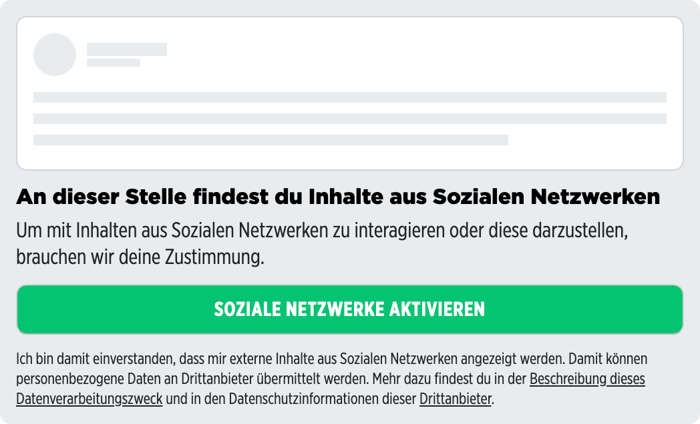

# Placeholder Pur component for Podigee embeds

> This component is also being used as the base component for vendor specific placeholder components in context of Pur.

<p>
  
</p>

<details>
<summary>Example</summary>

```vue
<template>
  <embed-podigee-placeholder-pur
    :privacyManagerId="privacyManagerId"
    :privacyManagerIdDenyTracking="privacyManagerIdDenyTracking"
  ></embed-podigee-placeholder-pur>
</template>

<script>
import { EmbedPodigeePlaceholderPur } from '@spring-media/red-sourcepoint-cmp/dist/esm/vue/components';

export default {
  components: { EmbedPodigeePlaceholderPur },
  data: () => ({
    privacyManagerId: 12345,
    privacyManagerIdDenyTracking: 67891,
  }),
};
</script>

<style lang="scss">
@import '~@spring-media/red-sourcepoint-cmp/dist/esm/vue/components.css';
</style>
```

</details>

## Props

| Name                         | Type   | Required | Description                                                                                     |
| ---------------------------- | ------ | -------- | ----------------------------------------------------------------------------------------------- |
| privacyManagerId             | number | true     | Id of a privacy manager to open when clicking on certain areas within the placeholder           |
| privacyManagerIdDenyTracking | number | true     | Id of a different privacy manager to open when clicking on certain areas within the placeholder |
