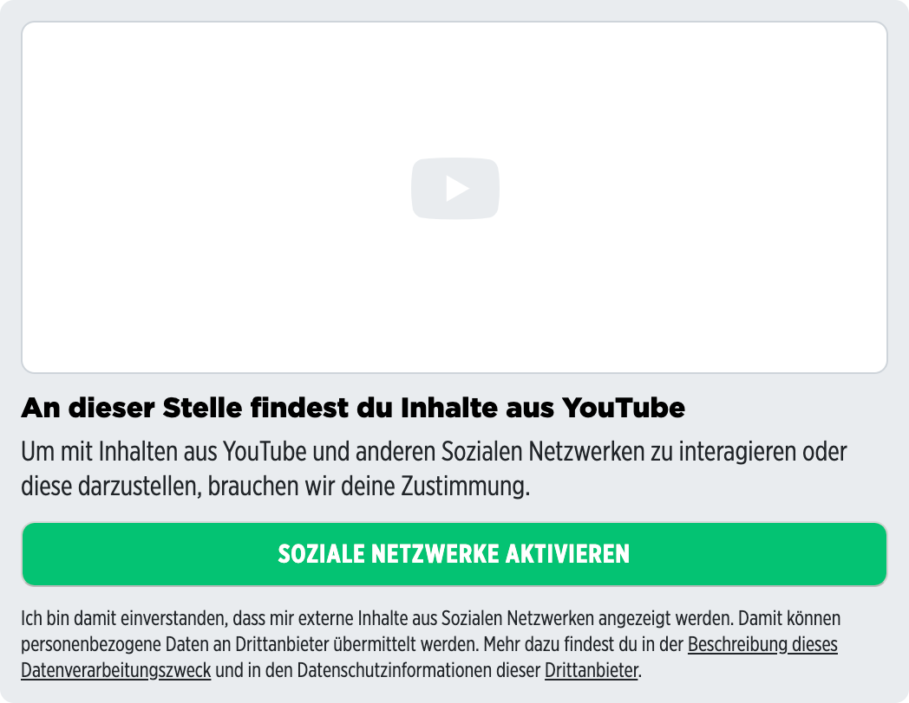

# Placeholder component for Youtube embeds

<p>
  
</p>

<details>
<summary>Example</summary>

```javascript
<template>
  <embed-youtube-placeholder></embed-youtube-placeholder>
</template>

<script>
import { EmbedYoutubePlaceholder } from '@spring-media/red-sourcepoint-cmp/dist/esm/vue/components/EmbedYoutubePlaceholder';

export default {
  components: { EmbedYoutubePlaceholder },
};
</script>

<style lang="scss">
@import '~@spring-media/red-sourcepoint-cmp/dist/esm/vue/components/EmbedYoutubePlaceholder.css';
</style>
```
</details>

## Events

The placeholder component emits an event (requestConsent) by clicking either on the button or on one of the links in the footer.

<details>
<summary>Example</summary>

```javascript
<template>
  <embed-youtube-placeholder  @requestConsent="onRequestConsent()"></embed-youtube-placeholder>
</template>

<script>
import { EmbedYoutubePlaceholder } from '@spring-media/red-sourcepoint-cmp/dist/esm/vue/components/EmbedYoutubePlaceholder';

export default {
  components: { EmbedYoutubePlaceholder },
  methods: {
    onRequestConsent() {
      console.log("request consent");
    },
  },
};
</script>

<style lang="scss">
@import '~@spring-media/red-sourcepoint-cmp/dist/esm/vue/components/EmbedYoutubePlaceholder.css';
</style>
```
</details>
